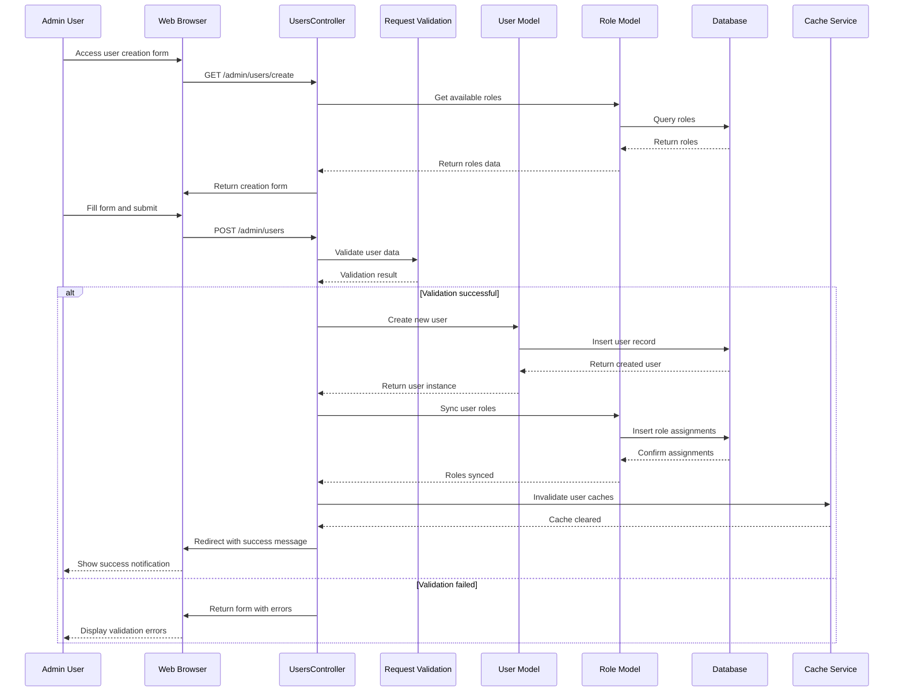
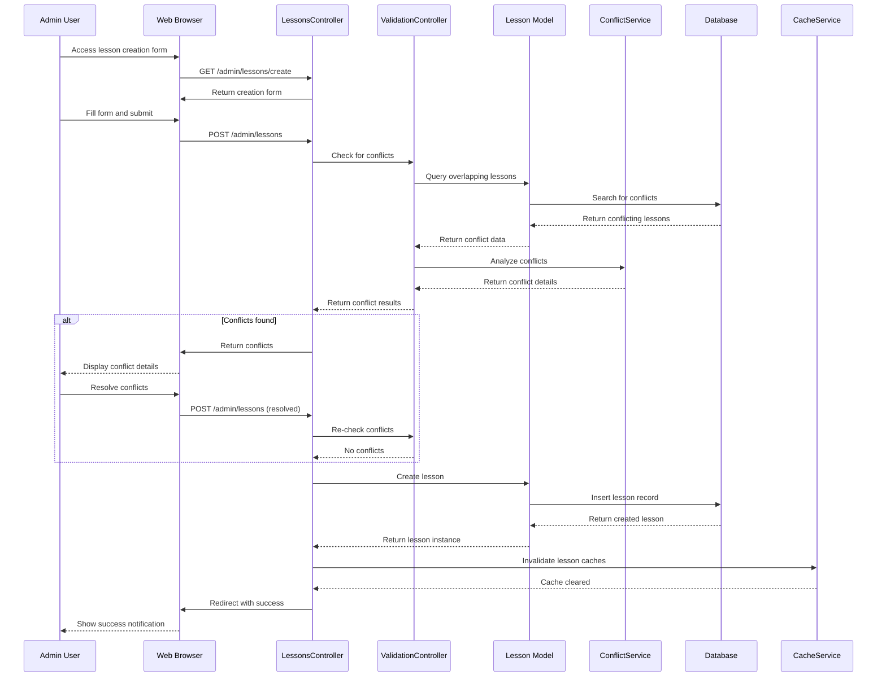
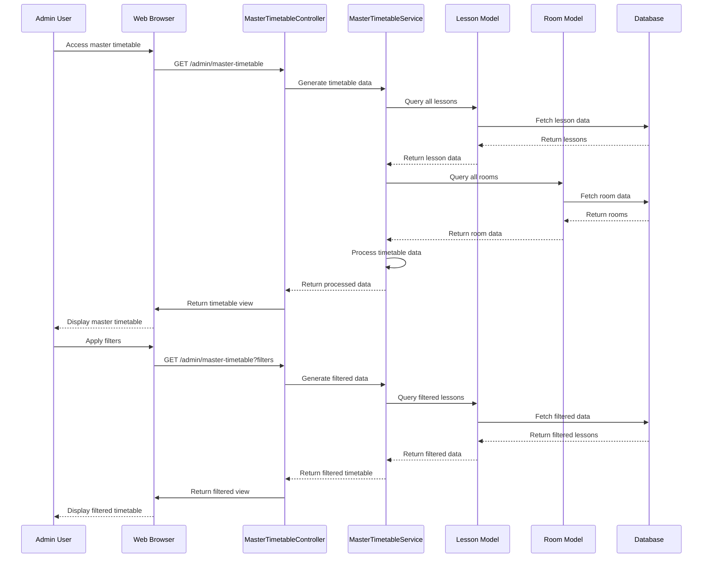
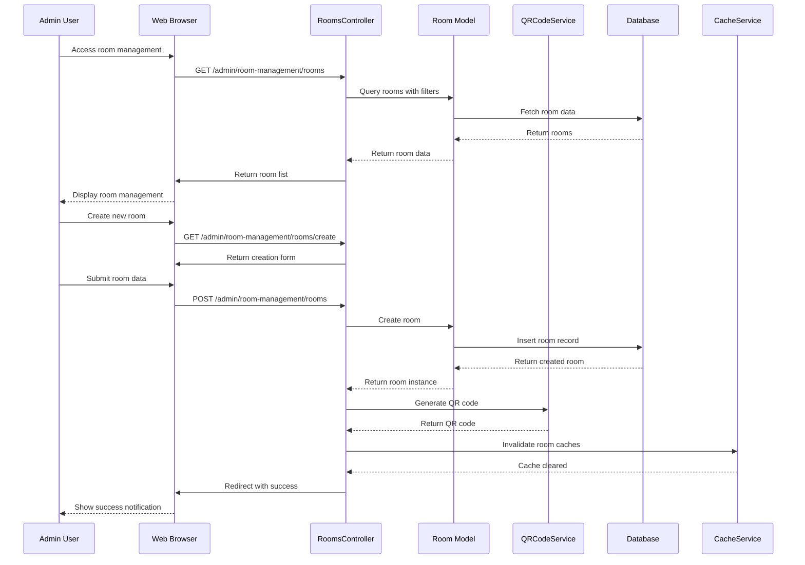
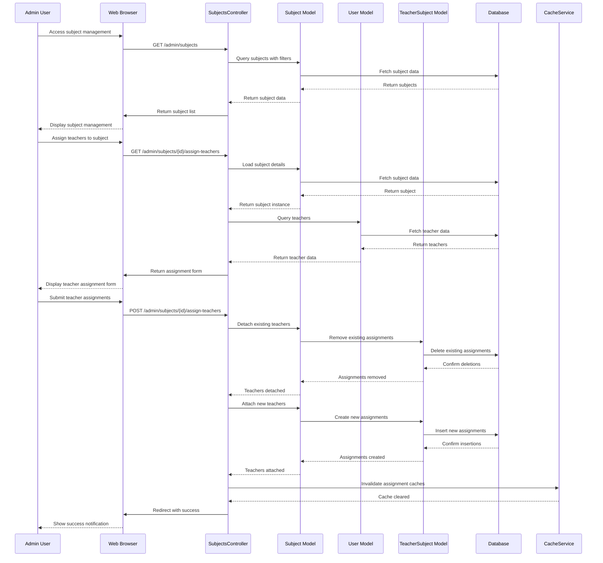
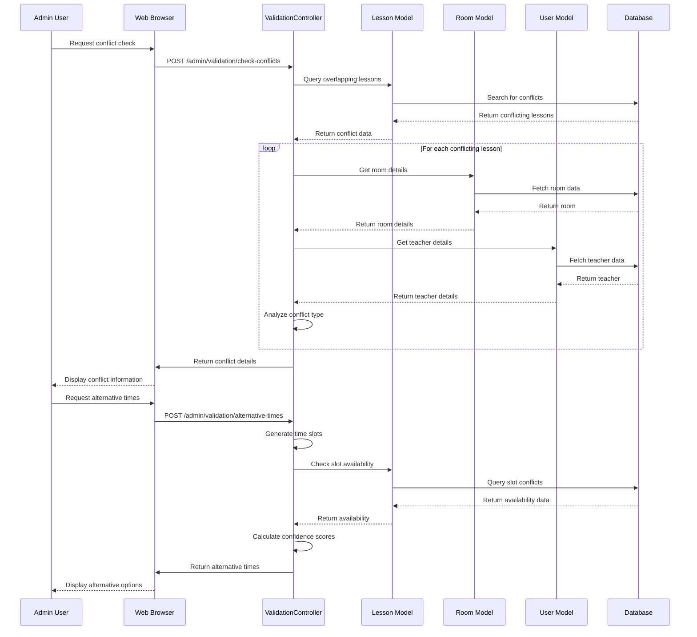

# Admin User Sequence Diagram

## Admin User Creation Sequence

## Admin Lesson Creation with Conflict Detection Sequence

## Admin Master Timetable View Sequence

## Admin Room Management Sequence

## Admin Subject Management with Teacher Assignment Sequence

## Admin System Validation Sequence

