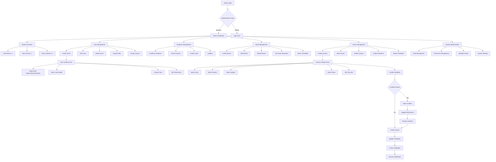
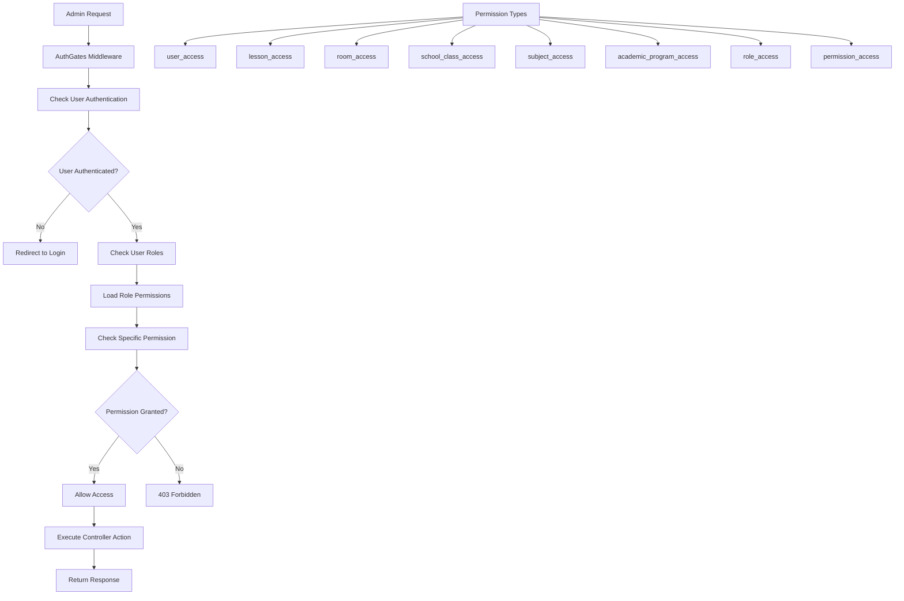
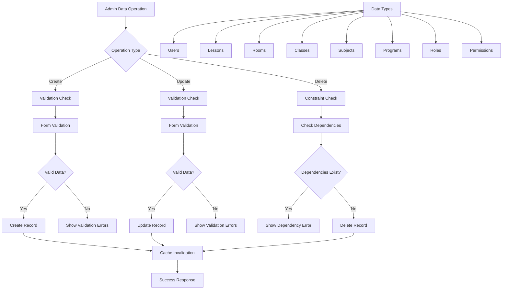

# Admin User System Flowchart

## Admin User Access Flow

```mermaid
flowchart TD
    A[Admin Login] --> B{Authentication Check}
    B -->|Success| C[Admin Dashboard]
    B -->|Failure| D[Login Error]
    
    C --> E[System Overview]
    E --> F[Total Rooms: X]
    E --> G[Total Lessons: Y]
    E --> H[Active Teachers: Z]
    
    C --> I[User Management]
    I --> I1[Create Users]
    I --> I2[Edit Users]
    I --> I3[Delete Users]
    I --> I4[Assign Roles]
    I --> I5[Assign Classes]
    
    C --> J[Academic Management]
    J --> J1[Academic Programs]
    J --> J2[School Classes]
    J --> J3[Grade Levels]
    J --> J4[Subjects]
    
    C --> K[Room Management]
    K --> K1[Create Rooms]
    K --> K2[Edit Rooms]
    K --> K3[Delete Rooms]
    K --> K4[QR Code Generation]
    K --> K5[Room Timetables]
    
    C --> L[Lesson Management]
    L --> L1[Create Lessons]
    L --> L2[Edit Lessons]
    L --> L3[Delete Lessons]
    L --> L4[Conflict Detection]
    L --> L5[Master Timetable]
    
    C --> M[System Administration]
    M --> M1[Role Management]
    M --> M2[Permission Management]
    M --> M3[Validation Rules]
    M --> M4[System Settings]
    
    I1 --> N[User Creation Form]
    N --> N1[Select Role: Admin/Teacher/Student]
    N --> N2[Enter User Details]
    N --> N3[Assign Class]
    N --> N4[Set Permissions]
    
    L1 --> O[Lesson Creation Form]
    O --> O1[Select Class]
    O --> O2[Select Teacher]
    O --> O3[Select Subject]
    O --> O4[Select Room]
    O --> O5[Set Time Slot]
    O --> O6[Conflict Validation]
    
    O6 --> P{Conflicts Found?}
    P -->|Yes| Q[Show Conflicts]
    P -->|No| R[Create Lesson]
    Q --> S[Suggest Alternatives]
    S --> T[Resolve Conflicts]
    T --> R
    
    R --> U[Update Timetables]
    U --> V[Cache Invalidation]
    V --> W[Success Notification]
```

## Admin Permission System Flow

```mermaid
flowchart TD
    A[Admin Request] --> B[AuthGates Middleware]
    B --> C[Check User Authentication]
    C --> D{User Authenticated?}
    D -->|No| E[Redirect to Login]
    D -->|Yes| F[Check User Roles]
    F --> G[Load Role Permissions]
    G --> H[Check Specific Permission]
    H --> I{Permission Granted?}
    I -->|Yes| J[Allow Access]
    I -->|No| K[403 Forbidden]
    
    J --> L[Execute Controller Action]
    L --> M[Return Response]
    
    N[Permission Types] --> N1[user_access]
    N --> N2[lesson_access]
    N --> N3[room_access]
    N --> N4[school_class_access]
    N --> N5[subject_access]
    N --> N6[academic_program_access]
    N --> N7[role_access]
    N --> N8[permission_access]
```

## Admin Data Management Flow

```mermaid
flowchart TD
    A[Admin Data Operation] --> B{Operation Type}
    B -->|Create| C[Validation Check]
    B -->|Update| D[Validation Check]
    B -->|Delete| E[Constraint Check]
    
    C --> F[Form Validation]
    F --> G{Valid Data?}
    G -->|Yes| H[Create Record]
    G -->|No| I[Show Validation Errors]
    
    D --> J[Form Validation]
    J --> K{Valid Data?}
    K -->|Yes| L[Update Record]
    K -->|No| M[Show Validation Errors]
    
    E --> N[Check Dependencies]
    N --> O{Dependencies Exist?}
    O -->|Yes| P[Show Dependency Error]
    O -->|No| Q[Delete Record]
    
    H --> R[Cache Invalidation]
    L --> R
    Q --> R
    R --> S[Success Response]
    
    T[Data Types] --> T1[Users]
    T --> T2[Lessons]
    T --> T3[Rooms]
    T --> T4[Classes]
    T --> T5[Subjects]
    T --> T6[Programs]
    T --> T7[Roles]
    T --> T8[Permissions]
```
